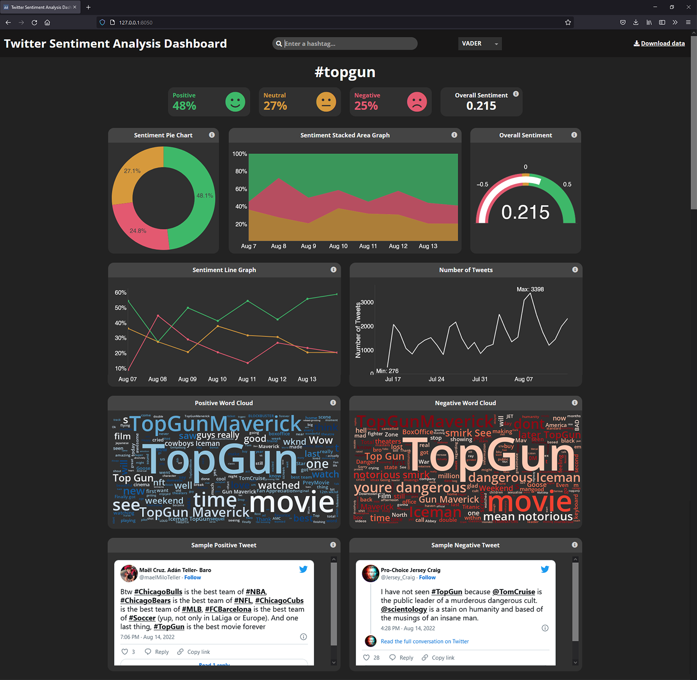

## Twitter Sentiment Analysis Dashboard
***
A sentiment analysis dashboard for Twitter. The user inputs a hashtag, and the dashboard returns figures and statistics about the sentiment of that hashtag based on tweets containing the hashtag over the past seven days.




### Directory Breakdown
```
twitter-sentiment-analysis-dashboard/
├── assets/
│   └── style.css                  # CSS stylesheet for dashboard
├── open-sans/
│   └── OpenSans-Semibold.ttf      # Font file for word cloud
├── app.py                         # Main dashboard file
├── credentials.py                 # Twitter API keys
└── requirements.txt               # Required Python libraries
```

### Installation
Clone or download the repository:
```
https://github.com/tom-troughton/twitter-sentiment-analysis-dashboard.git
```

To install required Python libraries execute the following command:
```
pip install -r requirements.txt
```

test